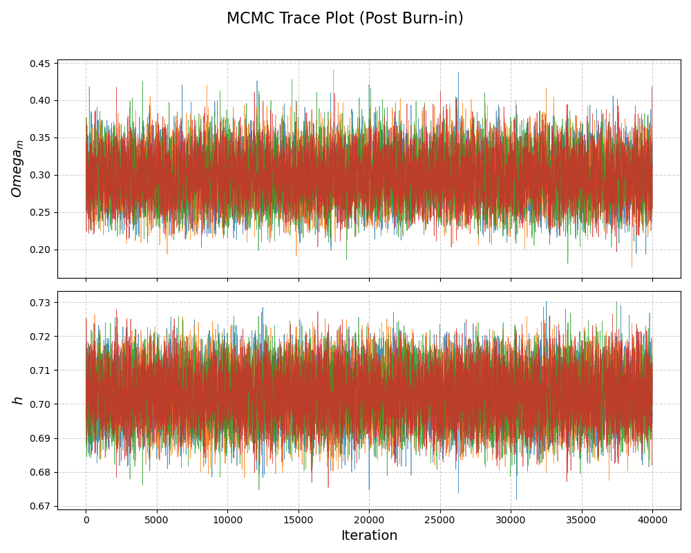
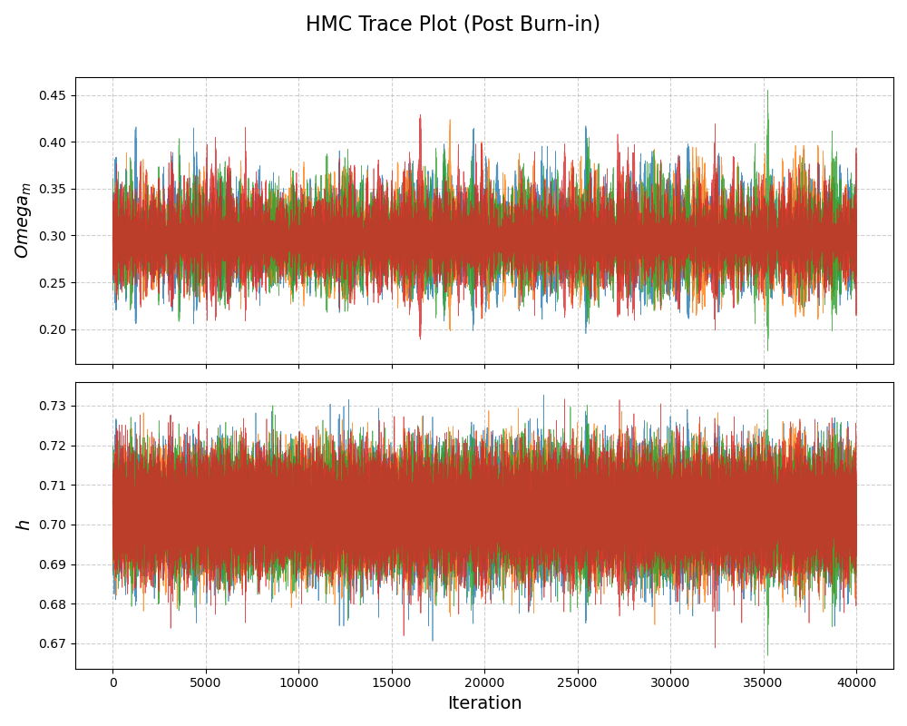
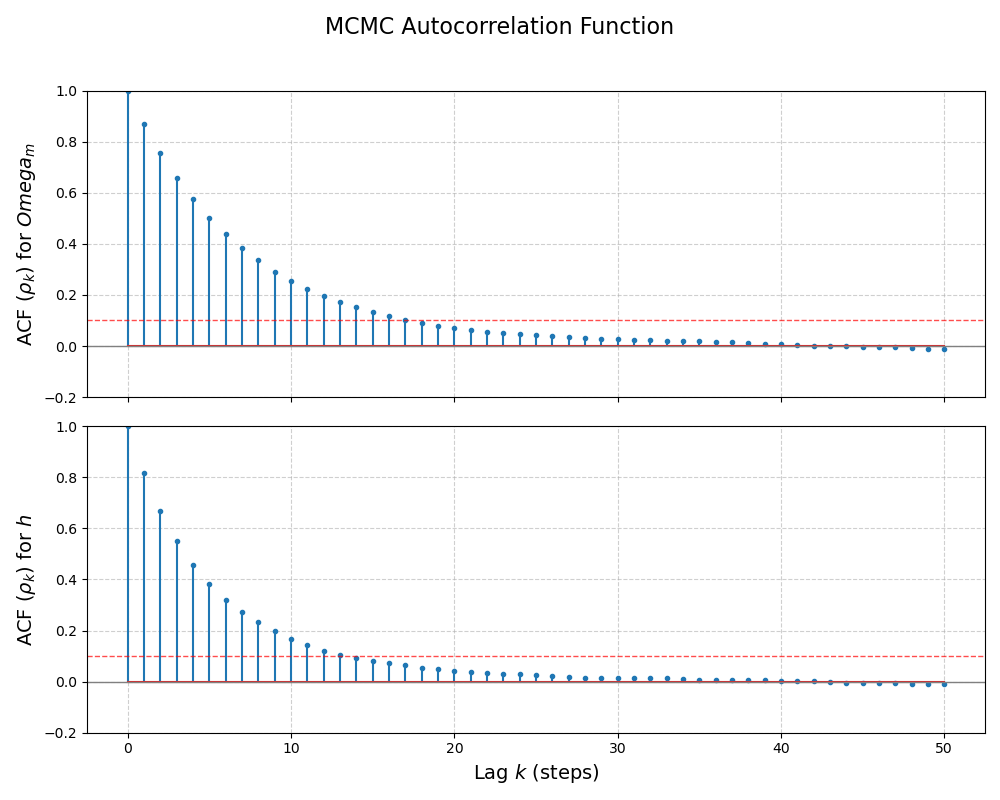
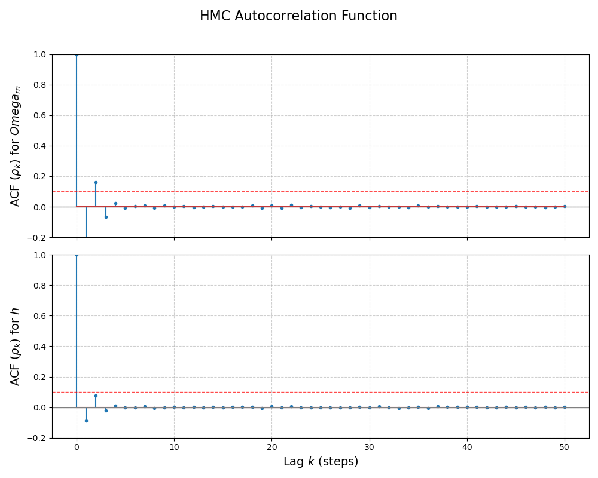
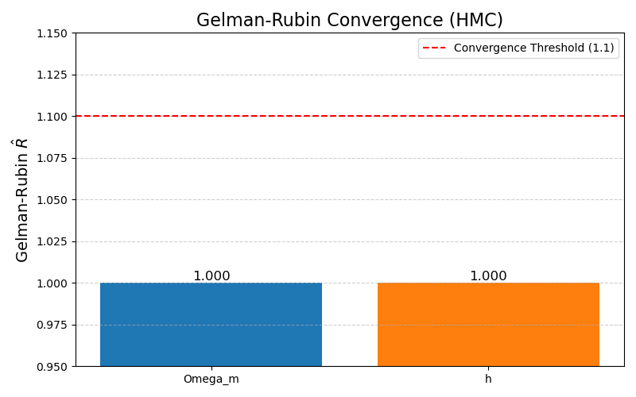
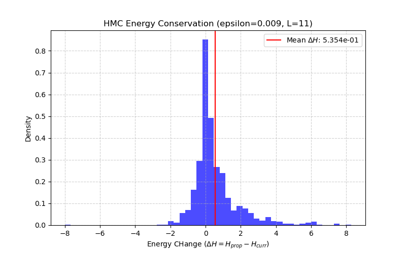
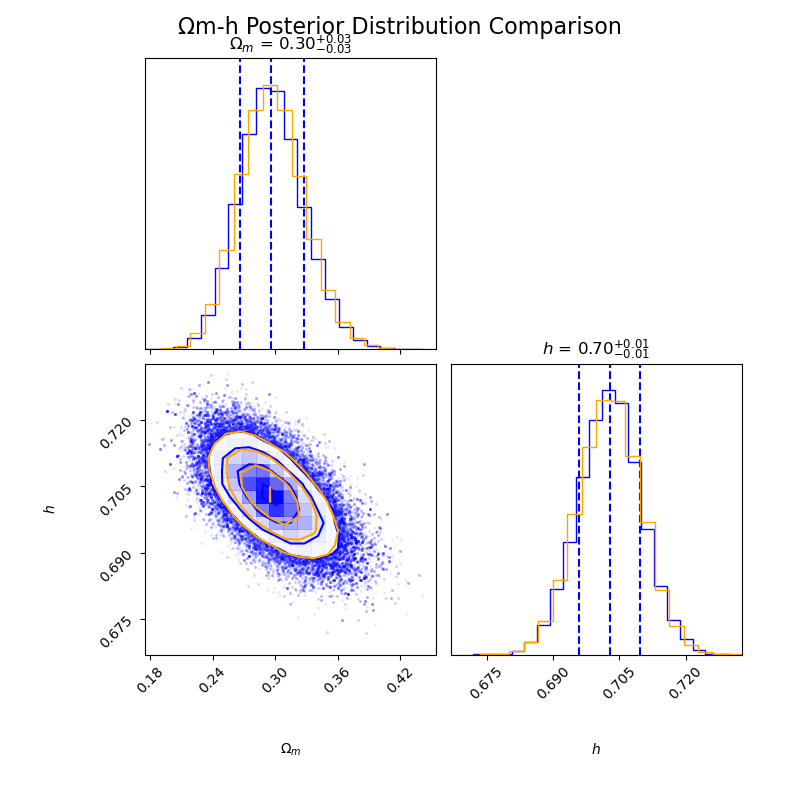
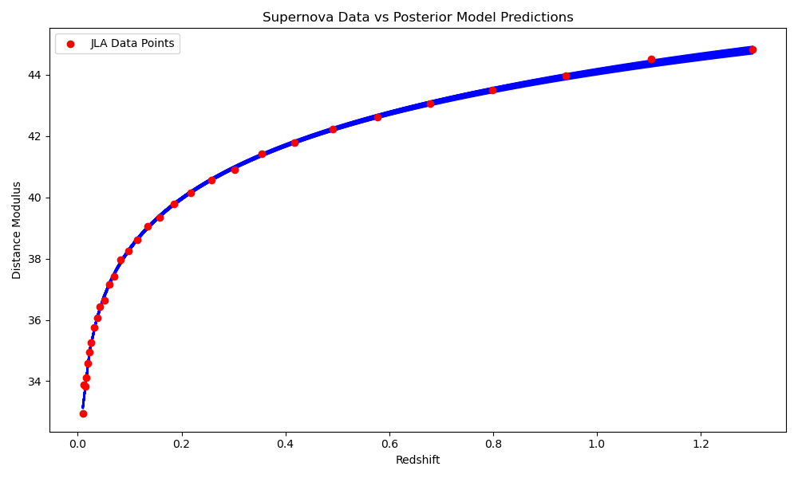
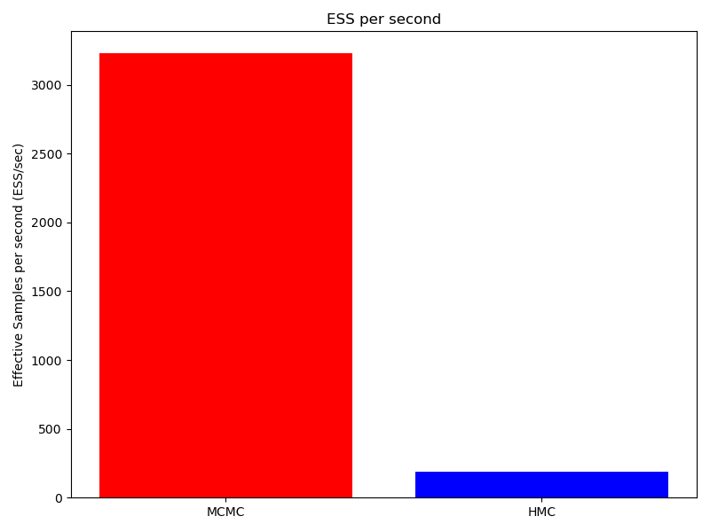

Name: Aisling Acuna

Date: 11/12/2025

Project: Project 4 - Building a Universal Inference Engine

# Executive Summary
The goal of this project was to build a universal Bayesian inference engine and apply it to determine the composition and expansion rate of the universe. Within this project, a goal was to infer the cosmological parameters, matter density ($\Omega _m$​) and the Hubble constant ($h$), from the JLA Type Ia supernova data. To do this, I had to move beyond a simple $\chi^2$ fit to fully sample the posterior distribution, quantifying between $\Omega _m$​ and $h$. The inference machinery was implemented using two sampling algorithms. First, a Metropolis-Hastings (MCMC) sampler was built, which required specifc tuning of the proposal covariance to achieve an optimal acceptance rate of 20-50%. This was then compared with to a gradient-based sampler, Hamiltonian Monte Carlo (HMC). The HMC sampler required calculating the gradient of the log-posterior and using the Leapfrog integration. 

# Methodology

## Forward Model and Likelihood
The forward model, in `cosmology.py`, computes the theoretical distance modulus ($\mu (z;\Omega _m;h)$) for a flat $\lambda$CDM universe. The luminosity distance $D_L(z)$ was calculated using the Pen approximation (1999), which was validated with direct numerical integration using `scipy.integrate.quad`. The parameter bounds were set by flat, uniform priors: $\Omega _m = [0, 1.2]$ and $h = [0.5, 0.9]$. 

The log-likelihood, $ln\mathcal{L}(\theta) = -\frac{1}{2}\mathbf{r}^\top \mathbf{C}^{-1} \mathbf{r}$, was computed using the full 31x31 covariance matrix (C) from the JLA data set. The inverse covariance was computed using the Cholesky decomposition, `(cho_factor)`.

## Sampling Algorithms and Tuning
Two samplers were developed:
- Metropolis-Hastings (MCMC): This is a random walk MCMC sampler, which was implemented in `mcmc.py`. This algorithm was tuned in iterations by adjusting the proposal covariance until the acceptance rate fell within 20-50%. 
- Hamiltonian Monte Carlo (HMC): This is a gradient based sampler, which was implemented in `hmc.py`. The core of this algorithm was the Leapfrog integrator, which required computing the gradient of the potential energy. HMC was tuned to target a higher acceptance rate (60-80%) by adjusting the step size ($\epsilon$) and the trajectory length ($L$). For this project, the chosen tuning to achieve a good acceptance rate was $\epsilon=0.009$ and $L=11$.

## Convergence and Validation
Four independent chains were run for both MCMC and HMC. I assessed convergence using the following metrics, computed on post burn-in samples (20% burn-in discarded):
- Gelman-Rubin Statistic: Convergence was confirmed when the scale reduction factor ($\hat{R}$) was less than 1.1 for all parameters. This can be seen in Figure 5.
- Effective Sample Size (ESS): The ESS is used to determine the true number of independent samples and to quantify sampler efficiency. This can be seen in Figure 9. 

# Results
## Cosmological Parameter Estimates
Once the burn-in is discarded and multiple chain have been pooled, I analyzed the posterior distribution. The parameter estimates for the 16th, 50th, and 84th percentiles are the following:
- MCMC $\Omega_m$: 0.2666, 0.2959, 0.3276
- MCMC $h$: 0.6958, 0.7029, 0.7098
- HMC $\Omega_m$: 0.2666, 0.2963, 0.3276
- HMC $h$: 0.6958, 0.7029, 0.7099

The $\Omega_m$ values confirm that the simulated univserse is being dominated by dark energy. The distance modulus measurements constrain the universe to be approximately 30% matter and 70% dark energy. 

# Computational Performance
## Efficiency Comparions (MCMC vs HMC)
The main method to compare the sampler's performance is the Effective Samples per second (ESS/sec). HMC should show higher efficiency then MCMC, due to its use of gradient steps instead of the random-walk steps. As seen in Figure 9, my HMC algorithm is slower than my MCMC one. Due to this, my MCMC sampler has a higher value of ESS/sec compared to my HMC sampler. This is most likely due to the high computational cost the finite difference gradient calculation used in the HMC sampler. 

## Autocorrelation Analysis
The autocorrelation plots, as seen in Figures 3 and 4, show that the HMC chains decay to a near-zero auto-correlation faster than the MCMC chains. This confirms that the samples generated by HMC are more independent than those from MCMC. 

# Extension:
For this project extension, I attempted to upgrade the HMC gradient calculation from the approximation method to the exact method using the JAX library. This required an adaptation of the cosmological likelihood function to be JAX-compatible. However, I had issues within my JAX implementation that prevented me from having successful compuations of the chains. 

# Appendices
## A: Trace Plots
### MCMC Trace

*Figure 1: Trace plot of MCMC chains (4 independent chains) showing parameter values ($\Omega_m$​ and h) versus iteration.*
### HMC Trace

*Figure 2: Trace plot of HMC chains (4 independent chains) showing parameter values ($\Omega_m$​ and h) versus iteration.*
## B: Autocorrelation Plots
### MCMC ACF

*Figure 3: Autocorrelation function (ACF) plot for the MCMC pooled samples, showing $\rho_k$​ versus lag k.*
### HMC ACF

*Figure 4: Autocorrelation function (ACF) plot for the HMC pooled samples, showing $\rho_k$​ versus lag k.*
## C: Diagnostics

*Figure 5: Gelman-Rubin convergence plot showing the final $\hat{R}$ values for $\Omega_m$​ and h, compared against the convergence threshold of $\hat{R} < 1.1$.*

## D: Energy Histogram

*Figure 6: Histogram of the energy change ($\Delta$ H) across the HMC trajectory steps, validating the conservation of energy.*

## E: Corner Plot

*Figure 7: Corner plot showing the posterior distributions for $\Omega_m$ and h, based on the pooled MCMC and HMC samples.*

## F: Data vs Model

*Figure 8: JLA supernova data points (distance modulus vs. redshift) overlaid with 100 random model predictions from the posterior distribution, showing the model uncertainty.*

## G: Efficiency Comparison

*Figure 9: Bar chart comparing the efficiency (Effective Samples per Second, ESS/sec) of the MCMC sampler against the HMC sampler.*